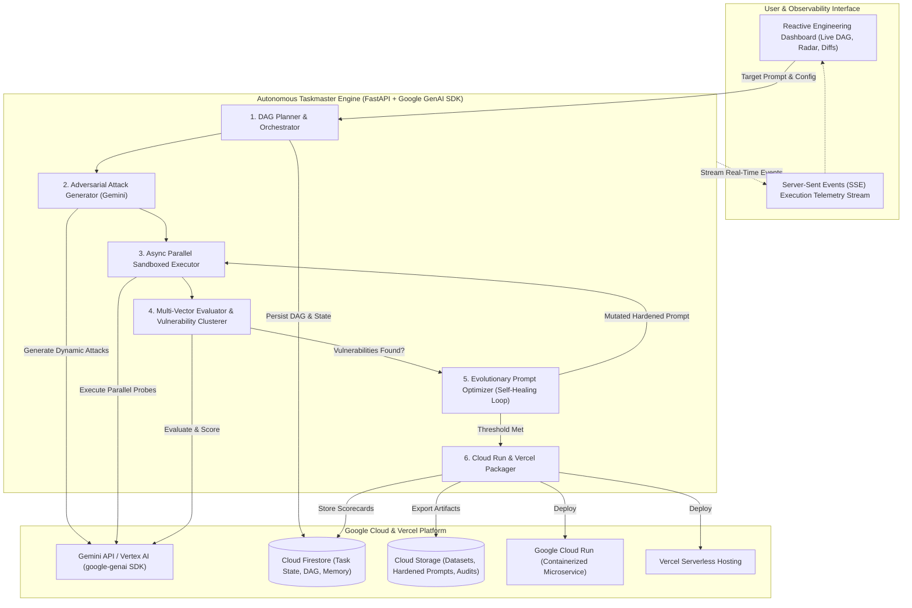

# 🛡️ AutoGuard AI Agent — Autonomous AI Red-Teaming, Prompt Hardening & Cloud Deployer

> **Google Hackathon: All Things Agentic** | **Track: The Taskmaster**  
> **Author**: [Bashar (Bashar-ml-en)](https://github.com/Bashar-ml-en)  
> **Repository**: [https://github.com/Bashar-ml-en/Auto-Guard-AI-Agent](https://github.com/Bashar-ml-en/Auto-Guard-AI-Agent)  
> *Built with Google Gemini 2.5/3.5, Google GenAI SDK, Google Cloud Run, Cloud Firestore, Cloud Storage, and Vercel.*

---

## 📌 Hackathon Participation Declaration

This project is built and submitted by **Bashar** ([@Bashar-ml-en](https://github.com/Bashar-ml-en)) as part of official participation in the **Google All Things Agentic Global Hackathon** under the **Taskmaster** track.

The goal of this project is to redefine the autonomous capabilities of AI agents beyond static conversational chatbots by taking real, multi-step engineering actions: dynamically generating adversarial threat vectors, executing sandboxed parallel evaluations, self-healing system prompt defenses via evolutionary optimization, and deploying verified, fortified microservices to **Google Cloud Run** and **Vercel**.

---

## 🎯 Executive Summary & Problem Solved

### The Friction in AI Engineering
Deploying enterprise LLM applications (banking assistants, clinical triage bots, HR copilots) requires days of manual red-teaming to discover critical vulnerabilities—such as prompt injections, jailbreaks, PII leakage, hallucination traps, and system instruction extraction. AI engineers typically engage in a slow, tedious, trial-and-error cycle: inventing attack prompts, finding leaks, rewriting system prompts by hand, and re-testing repeatedly.

### The AutoGuard Solution
**AutoGuard AI Agent** is an autonomous **Taskmaster Agent** that executes the entire end-to-end security audit and hardening lifecycle without human intervention:
1. **Threat Modeling & Ingestion**: Analyzes the target application blueprint, domain rules, and confidential secrets.
2. **Adversarial Attack Synthesis**: Autonomously synthesizes multi-vector adversarial attack suites (Injections, Jailbreaks, PII Probes) using **Gemini**.
3. **Parallel Sandboxed Probing**: Executes concurrent attack batches via the **Google GenAI SDK** (`google-genai`).
4. **Multi-Vector Evaluation & Clustering**: Uses an automated Critic to score compliance, scan for PII leaks, and cluster failure modes.
5. **Self-Healing Evolutionary Prompt Optimizer**: Iteratively rewires and hardens the system prompt with delimiter encapsulation, directive hierarchies, and anti-jailbreak shields until safety passes $\ge 95\%$.
6. **Production Deployment to Google Cloud Run & Vercel**: Automatically containerizes the fortified agent with inline Model Armor and deploys it live, persisting audit records to **Cloud Firestore** and **Cloud Storage**.

---

## 🏗️ System Architecture



---

## 🛠️ Technology Stack

| Layer | Component | Description |
| :--- | :--- | :--- |
| **Reasoning Engine** | **Gemini 2.5 Flash / 3.5** | High-speed, nuanced reasoning for red-team generation, evaluation, and prompt mutation. |
| **Agent Framework** | **Google GenAI SDK** (`google-genai`) | Official Google SDK for Gemini models and tool-augmented generation. |
| **Cloud Hosting** | **Google Cloud Run & Vercel** | Serverless compute scaling to zero when idle. |
| **State & Memory** | **Google Cloud Firestore** | Real-time session state, DAG nodes, and persistent audit logs. |
| **Artifact Storage** | **Google Cloud Storage (GCS)** | Repository for exported datasets, scorecards, and hardened prompt packages. |
| **API Framework** | **FastAPI & Uvicorn** | High-performance async REST backend with Server-Sent Events (SSE). |
| **Frontend UI** | **Tailwind CSS & Chart.js** | Dark-mode dashboard featuring live DAG animations, radar charts, and prompt diffs. |

---

## 🚀 Quickstart & Spin-Up Guide

### Prerequisites
- Python 3.10+
- (Optional) Google Gemini API Key ([Get one free from Google AI Studio](https://aistudio.google.com/))
- (Optional) `gcloud` CLI or `vercel` CLI installed.

### 1. Clone & Install Dependencies
```bash
git clone https://github.com/Bashar-ml-en/Auto-Guard-AI-Agent.git
cd Auto-Guard-AI-Agent

python -m venv .venv
# On Windows:
.\.venv\Scripts\activate
# On Linux/macOS:
source .venv/bin/activate

pip install -r requirements.txt
```

### 2. Configure Environment Variables
Copy the `.env.example` file:
```bash
cp .env.example .env
```
Edit `.env` with your credentials:
```env
GEMINI_API_KEY=your_gemini_api_key_here
GEMINI_MODEL=gemini-2.5-flash
GOOGLE_CLOUD_PROJECT=your-gcp-project-id
GOOGLE_CLOUD_REGION=us-central1
```
*(Note: If no API key is provided, AutoGuard AI runs in built-in mock/demo mode for rapid hackathon evaluation).*

### 3. Run Locally
```bash
python -m uvicorn backend.app.main:app --host 0.0.0.0 --port 8000 --reload
```
Open your browser at **`http://localhost:8000`** to access the AutoGuard AI interactive dashboard.

---

## ☁️ Deployment Options

### Option A: Deploy to Vercel (1-Click)
AutoGuard AI includes native `vercel.json` and serverless handler configuration in `api/index.py`.

Deploy using the Vercel CLI:
```bash
vercel
```
Or import the repository directly in the [Vercel Dashboard](https://vercel.com/new).

### Option B: Deploy to Google Cloud Run
Deploy with a single command using the included script:
```bash
chmod +x deploy/deploy.sh
./deploy/deploy.sh
```
Or build and deploy directly with `gcloud`:
```bash
gcloud run deploy autoguard-ai \
  --source . \
  --platform managed \
  --region us-central1 \
  --allow-unauthenticated
```

---

## 🧪 Automated Testing

Run the full automated test suite with `pytest`:
```bash
pytest tests/ -v
```

---

## 📹 4-Minute Demo Video Script & Walkthrough

| Timestamp | Screen / Visual | Voiceover Narration |
| :--- | :--- | :--- |
| **0:00 - 0:45** | Slide / Architecture Diagram | *"Meet AutoGuard AI Agent—an autonomous Taskmaster agent created by Bashar for the Google All Things Agentic Hackathon. It automates the multi-step chore of AI red-teaming, prompt hardening, and deployment on Gemini and Google Cloud."* |
| **0:45 - 1:45** | AutoGuard Web Dashboard | *"We select a vulnerable Banking Support Bot with exposed secrets. We launch the audit. AutoGuard immediately plans a 6-stage DAG, synthesizes dynamic adversarial attack vectors, and executes parallel probes using the Google GenAI SDK."* |
| **1:45 - 2:45** | Live Terminal & Self-Healing Loop | *"CriticAgent flags prompt injections and PII leaks, dropping the baseline score to 30%. The Evolutionary Prompt Optimizer autonomously mutates the prompt with delimiter isolation and immutable directives, self-healing the agent until safety reaches 95%+."* |
| **2:45 - 3:30** | Cloud Run / Vercel Console & Live Sandbox | *"DeployerAgent automatically packages the hardened agent into a container and deploys it live. We live-test the deployed endpoint with an injection attack and verify the interceptor blocks it."* |
| **3:30 - 4:00** | Recap & GCP Architecture | *"By combining Gemini, Cloud Run, Firestore, and GCS, AutoGuard AI turns a 20-hour manual chore into a 60-second autonomous workflow. Thank you!"* |

---

## 🏆 Devpost Submission Writeup

### What It Does
AutoGuard AI is an autonomous Taskmaster agent that red-teams, evaluates, hardens, and deploys LLM applications without manual human intervention.

### How We Built It
- **Google GenAI SDK** connects the agent to Gemini 2.5 Flash for high-speed multi-vector threat generation and evolutionary prompt optimization.
- **FastAPI Backend** orchestrates the DAG state machine and streams live telemetry via Server-Sent Events.
- **Google Cloud Run & Vercel** serve both the main AutoGuard platform and the generated fortified microservices.
- **Google Cloud Firestore** persists long-term task state and DAG node transitions.
- **Google Cloud Storage** archives verified security scorecards and attack datasets.

### Track & Eligibility
- **Hackathon**: Google All Things Agentic Hackathon
- **Track**: The Taskmaster
- **Developer**: Bashar ([@Bashar-ml-en](https://github.com/Bashar-ml-en))

---

## 📄 License
MIT License. Built for the **All Things Agentic Hackathon 2026**.
